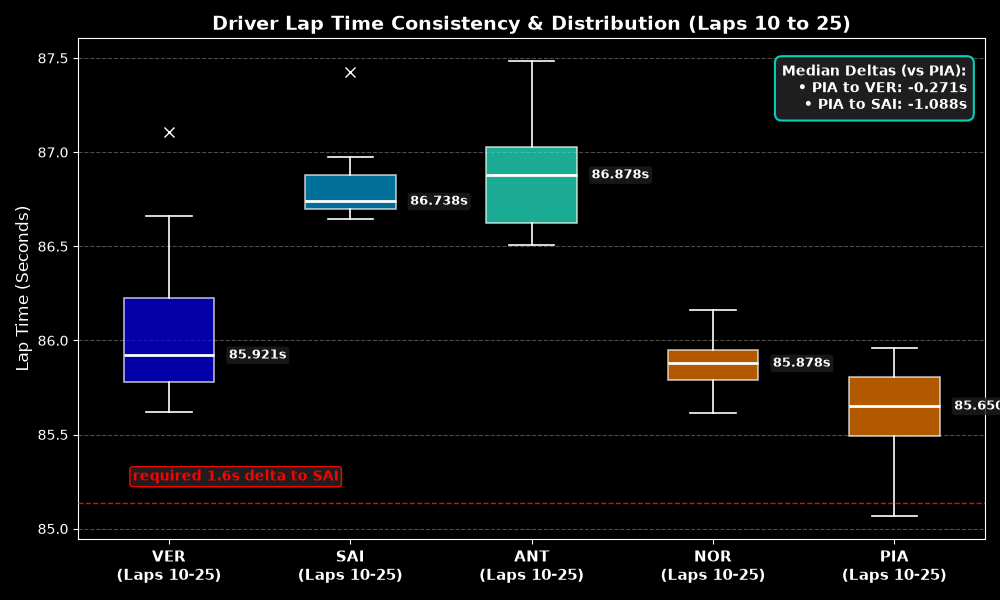
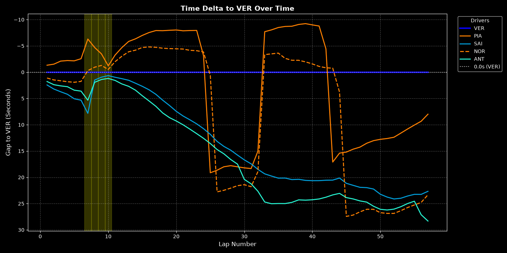
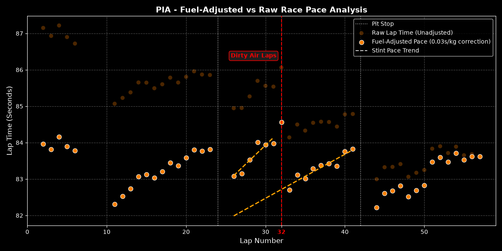
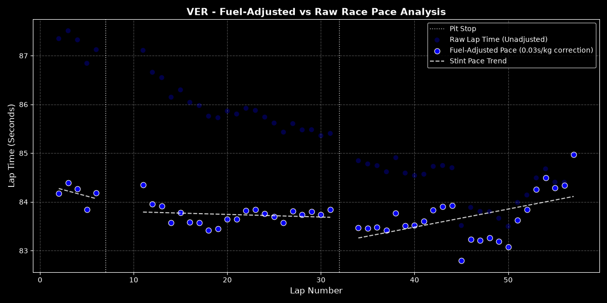
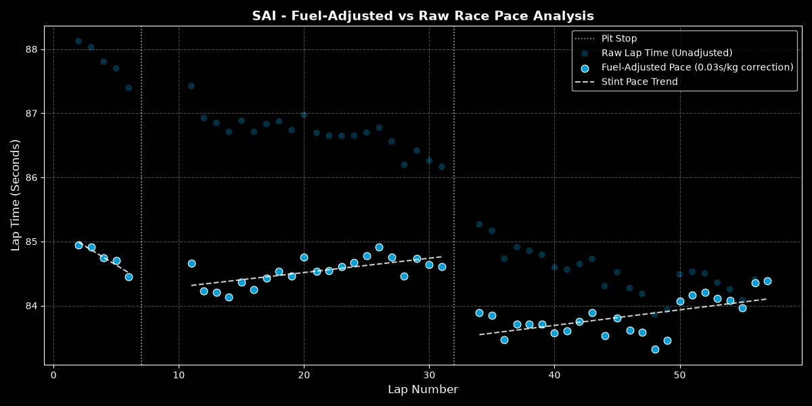
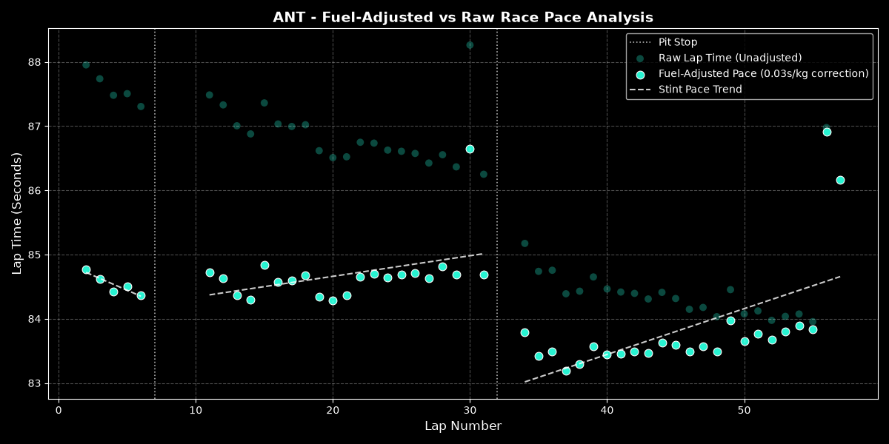

# 2025 Qatar Grand Prix: McLaren Strategy Retrospective Analysis

**Question:** Why did McLaren's decision to forgo a pit stop under the Lap 7 Safety Car fail to yield a race win despite holding P1–P3 track position?

**Quick Answer:**
When the Safety Car emerged on Lap 7, pitting offered a discounted pit stop while perfectly splitting the 57-lap race into two clean 25-lap stints ($7 + 25 + 25 = 57$), satisfying the FIA's mandatory stint cap. Since McLaren elected to stay out while every other car pitted, Max Verstappen was allowed a "free" stop and re-joined in P3 right behind the leading Maclaren. This put McLaren a net pit stop behind and without a traffic buffer or sufficient tire degradation to build a 24-second clean-air window, McLaren was then forced to leave both drivers two green-flag stops while Verstappen only needed one.
[Jump to Conclusion](#conclusions-and-takeaways)
## Context 
During this 2025 Qatar GP the FIA imposed a strict 25 lap stint length for the 57 lap race, forcing teams to run at least a 2 stop strategy.
Heading into Lap 7, Oscar Piastri led the Grand Prix from P1, with Max Verstappen in P2 and Lando Norris in P3. The Safety Car was deployed on Lap 7 and only Mclaren chose to stay out. 

## Why Did McLaren Stay Out?
Due to the 25 lap stint cap, pitting on lap 7 would force a pitstop on exactly lap 32. McLaren chose to keep strategic flexibility, hoping to extend their first stint under green flag conditions allowing them exploit a potential second Safety Car or Virtual Safety Car later in the race.

They assumed if a subset of the midfield stayed out, Max Verstappen would re-join in $P6$ or $P7$, giving Piastri and Norris the clean air to pull away towards their required pitstop delta time ~24 seconds.

McLaren expected higher levels of tire degradation on Verstappen’s 25 lap stints which would have been further impacted by driving behind the midfield's dirty air. Allowing them, on shorter stints, to regain the lost time caused by their extra pitstop.

## The Reality
When every driver pitted under the Safety Car, Verstappen retained P3 and restarted on Lap 10 only ~1.5s behind Piastri. This effectively handed Verstappen a "free" pit stop  and reduced the race after the restart into a two-stop Medium-Medium-Hard (ran by the McLarens) and a one-stop Medium-Hard for Verstappen.  

To effectively close on Verstappen after their first pitstop, Piastri and Norris needed to build a ~24s pit-loss window to Sainz and Antonelli in P4 and P5. With 15 laps available before the Lap 25 stint limit, McLaren needed a required pace advantage of ~1.6s/lap over Sainz.

  
   
  <b>Figure 1:</b> Lap 10-25 Pace Box Plot

However, the box plots prove that McLaren lacked the required pace
* Post Pit Delta: As seen on the Time Delta plot (figure 2), Piastri exited the pits ~6s behind Sainz and Antonelli. Re-joining in dirty air compromised his second stint and prevented both McLaren's from utilising their fresh Mediums to chase down the gap to Verstappen.
* Pace Deficit: Piastri’s median lap time was only ~1.1s/lap faster than Sainz—falling ~0.4s/lap short of the required threshold.

  
   
  <b>Figure 2:</b> Time Delta to VER 

Consequently during Laps 25–32, Piastri re-joined behind Sainz and Antonelli. Running in this dirty air severely accelerated thermal tire degradation which is evident by the steeper gradient during the dirty air laps in figure 3. Once the cars infront of Piastri made their mandatory pitstop on Lap 32, his lap times dropped sharply and by extrapolating the linear tyre wear line backwards it shows that traffic was potentially holding up Piastri 1 second each lap. However, the tire damage sustained during those six laps (in traffic) capped his ultimate stint length and pace. By Lap 42, Piastri could only extend his lead over Verstappen to ~9 seconds—meaning he emerged around 15 seconds behind Verstappen after his final pitstop (as demonstrated in figure 2). 

  
   
  <b>Figure 3:</b> Tyre degradation fuel lap times

When Piastri took his final mandatory stop on Lap 42 for Hard tires, he emerged in P3 behind Norris (P1, yet to pit) and Verstappen (P2) giving McLaren two options.

* Option 1) Hold Back Verstappen: Norris was leading the race on track directly ahead of Verstappen. Had McLaren extended Norris's stint by 2–3 laps to intentionally hold up Verstappen. Piastri—running on fresh tyres in clean air, was gaining aver a second a lap on Verstappen even without being held so with help from Norris they could have closed the gap and mounted an attack on P1.

* Option 2) Aid Norris: Because McLaren had already secured the Constructors' Championship in Singapore, their priorities split between Piastri's race-win and protecting Norris’s position in the Drivers' Standings.

Outcome: McLaren decided to pit Norris immediately after and released Verstappen into clean air. This effectively sealed the race outcome, leaving Piastri with insufficient remaining laps to overcome Verstappen’s net time advantage on track.

The Execution: Pitting Norris immediately on Lap 43 released Verstappen into clean air. This effectively sealed the race outcome, leaving Piastri with insufficient remaining laps to overcome Verstappen’s net time advantage on track.

## Verstappen
While Piastri had enough pace to create a large enough pit window to remain ahead of Antonelli and Sainz after pitting again he was still 15 seconds behind Verstappen. This was due to Verstappen maintaining an excellent pace in his stint after the saftey car (laps 10 to 32) and managing the tyre wear incredibly well. As shown in the plots below, Verstappen managed his tyres well and maintained a similar fuel adjusted pace for the entirety of his first stint, unlike Sainz and Antonelli. This was a clear indicator to McLaren that tyre degradation was not as detrimental to Verstappen's lap times as they predicted and drastically reduced their chances of taking back the lead.

<table>
  <tr>
    <td width="33.33%">
      
      
<b>Fig VER:</b> Fuel-Adjusted Pace

    </td>
    <td width="33.33%">
      
      
<b>Fig SAI:</b> Fuel-Adjusted Pace

    </td>
    <td width="33.33%">
      
      
<b>Fig ANT:</b> Fuel-Adjusted Pace

    </td>
  </tr>
</table>

## A Mathematical View of Saftey Car:
Letting $T$ be the random variable representing the final time delta between Oscar Piastri and Max Verstappen at the end of the race, we can model $T$ as:

$$
T \approx 24 + I_{\text{SC}} \cdot (-10)
$$

where:

* $24$ is the aproximate green-flag pit loss time (in seconds).
* $I_{\text{SC}}$ is the indicator variable representing at least one Safety Car deployment occurring within McLaren's actionable pit window ($I_{\text{SC}} = 1$ if an SC occurs, $0$ otherwise).
* $-10$ is the net time gained on the pit stop (in seconds) by pitting under Safety Car relative to a green-flag stop.
On taking the expected value:

$$E[T] \approx 24 - 10 \cdot E[I_{\text{SC}}]$$

For mathematical simplicity in our baseline model, we can approximate SC deployments as a Poisson Process with a constant rate parameter $\lambda$ per lap:

$$E[I_{\text{SC}}] = P(\text{SC} \ge 1) = 1 - P(\text{SC} = 0) = 1 - e^{-\lambda \cdot \Delta L}$$

where:
* $\Delta L = L_b - L_a + 1$ is the total length of the actionable pit window (in laps).
* $\lambda = \frac{N_{\text{SC}}}{L_{\text{total}}}$ is the constant per-lap Safety Car deployment rate estimated from historical race data.

So the expected time discount under the homogeneous assumption simplifies to:

$$E[I_{\text{SC}} \cdot (-10)] = -10 \cdot \left( 1 - e^{-\lambda \cdot \Delta L} \right)$$

* Note: A Non-Homogeneous Poisson Process with a lap-dependent rate $\lambda(l)$ would provide a more suitable model for actual race conditions since $\lambda(l)$ spikes during Lap 1 and immediately following restarts where cars are bunched together, then decreases as the field spreads out and overtakes become less frequent.

If we use our basic poison model with an optimistic 0.02 probability of a safety car per lap and a 35 lap suitable pit window we get $$0.5 \approx \cdot \left( 1 - e^{-0.02 \cdot 35} \right)$$ so even under a full safety car with grid bunching McLaren traded 24 seconds of additional pitstop time for a low chance to regain less than half of that time from another incident later on in the race. So ultimately, remaining flexible mathematically lowered their expected finishing position.

#### Model Assumptions:
The model deliberatley simplified the problem to only look at the affect of holding out for a better Safety Car and ignored all the other factors that would affect the final time delta. 

## Conclusions and Takeaways
McLaren’s loss at the 2025 Qatar Grand Prix was due to a live strategic miscalculation, misjudged tire degradation, and driver management.
* Their Critical flaws: They didn't assume full competitor rationality.
When the 25-lap stint cap was imposed the lap 7 Safety Car created an clear mathematical optimum strategy, So you should assume that all opposing teams will decide to pit too. Staying out under the Lap 7 Safety Car was built on the flawed expectation that the midfield would create a traffic shield. In reality, 100% of the field behind pitted and instantly handed Verstappen a free Pit stop.
* Similarly they overestimated the chance of another Safety Car. When calculating the expected value of the ending time delta between Piastri and Verstappen, choosing to stay out to retain strategic flexibility (ie looking for a disruption to capitalise on) is a sub optimal approach as the probability of an incident occurring within the correct window for them to capitalise on is small. Therefore McLaren took a gamble by accepting 24 seconds of guaranteed deficit for the lower probability of a more optimal Safety Car pit window occurring later in the race. Hence dropping their overall expected final position.  

